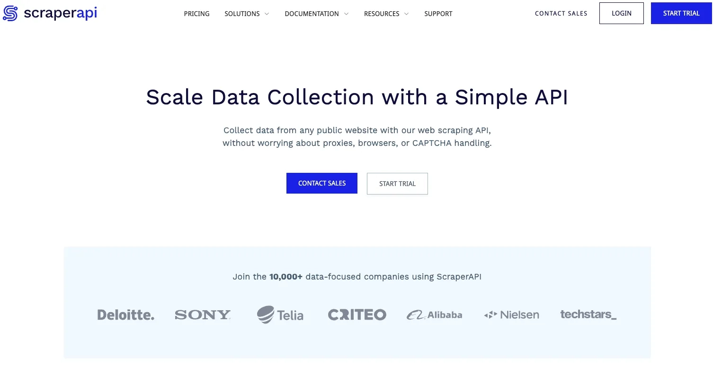

# Dynamic Proxy IPs: Building Undetectable Python Web Scrapers with ScraperAPI

---

Modern e-commerce sites, social platforms, and financial websites all have sophisticated anti-scraping mechanisms. Beyond standard HTTP headers, most sites now deploy AI-powered bot detection that triggers CAPTCHA challenges or straight-up IP bans the moment suspicious activity is detected. Once your IP gets blocked, you're forced to switch to proxy IPs to continue scraping.

One effective way to reduce detection risk is randomly rotating different proxy IPs and request headers. I recently discovered a tool that handles exactly this—and it's surprisingly straightforward to use. Plus, you get 1,000 free API calls to test it out. Let me walk you through how it works and why it might be exactly what your scraping project needs.

---

## What Is ScraperAPI Anyway?

Think of ScraperAPI as a supercharged anti-detection interface with built-in proxy rotation. Instead of managing proxies yourself, you send one simple request and get back the target page's HTML source code. Behind the scenes, it automatically rotates proxy IPs, switches HTTP headers, and handles CAPTCHA challenges—dramatically lowering your chances of getting caught.

To get started, head over to their website and hit "START TRIAL" to register. Once you're logged in, you'll see your API key along with code examples for all major programming languages:



The dashboard is clean and straightforward—everything you need is right there on the homepage.

---

## Running Your Python Scraper with ScraperAPI

After registration, your API key appears front and center on the dashboard. Guard this key carefully—anyone with access can burn through your quota. The homepage includes a ready-to-use Python example:

```python
import requests

payload = {
    'api_key': 'Your API key here.',
    'url': 'https://httpbin.org/ip'
}

r = requests.get('https://api.scraperapi.com/', params=payload)
print(r.text)
```

Run this code and you'll see httpbin.org's homepage HTML printed out. That's it—you've just scraped your first page through ScraperAPI.

But does it actually use proxy IPs? Let's verify. First, check your current IP address in your browser using any IP checker tool. Then modify the code above, changing the `url` value to point to that same IP checker:

```python
import requests

payload = {
    'api_key': 'Your API key here.',
    'url': 'https://spiderbuf.cn/tools/proxy-ip-checker'
}

r = requests.get('https://api.scraperapi.com/', params=payload)
print(r.text)
```

When the HTML prints out, compare the IP address with what you saw in your browser. They're different—proof that 👉 [ScraperAPI automatically rotated to a high-anonymity proxy IP without you lifting a finger](https://www.scraperapi.com/?fp_ref=coupons). No manual proxy configuration, no IP pool management, no headaches.

One important thing to understand: ScraperAPI handles the HTML retrieval part of web scraping. You still need to write your own code to parse and extract the actual data you want from that HTML. It's not a complete end-to-end solution, but it solves the hardest problem—getting past anti-bot defenses.

---

## Why This Matters for Your Scraping Projects

ScraperAPI provides a dead-simple API interface that lets you use dynamic proxy rotation in your Python scrapers without dealing with the usual complexity. For anyone looking to extract data from major websites with aggressive anti-bot systems, this is one of the easiest tools to get started with.

The free tier's 1,000 API calls give you plenty of room to test whether it fits your use case. And if you're tired of managing proxy lists, dealing with CAPTCHA solvers, and constantly adjusting request headers, 👉 [this might be exactly the solution that saves you hours of frustration](https://www.scraperapi.com/?fp_ref=coupons).
